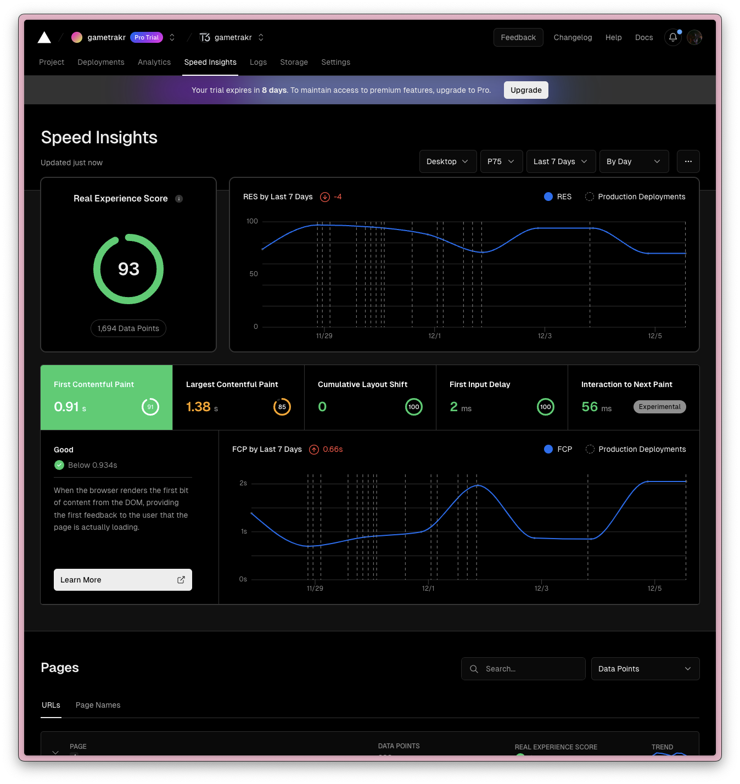

# Infrastructure

For infrastructure, we will be using [Vercel](https://vercel.com/), and GitHub Actions for CI and code scanning.

## Vercel

Vercel is a cloud platform for static sites and serverless functions. It is the easiest way to deploy websites. It is also the best way to deploy Next.js apps. They also provide all the tools you need to monitor and analyze your website's performance.

### Analytics

Web Analytics provides comprehensive insights into your website's visitors, tracking top pages, referrers, and demographics like location, operating systems, and browser info.

### Speed Insights

Vercel Speed Insights provides you with a detailed view of your website's performance metrics, facilitating informed decisions for its optimization.

### Logs

The Logs allows you to view, search, inspect, and share your runtime logs without any third-party integration. You can also filter and group your runtime logs based on the relevant fields.

