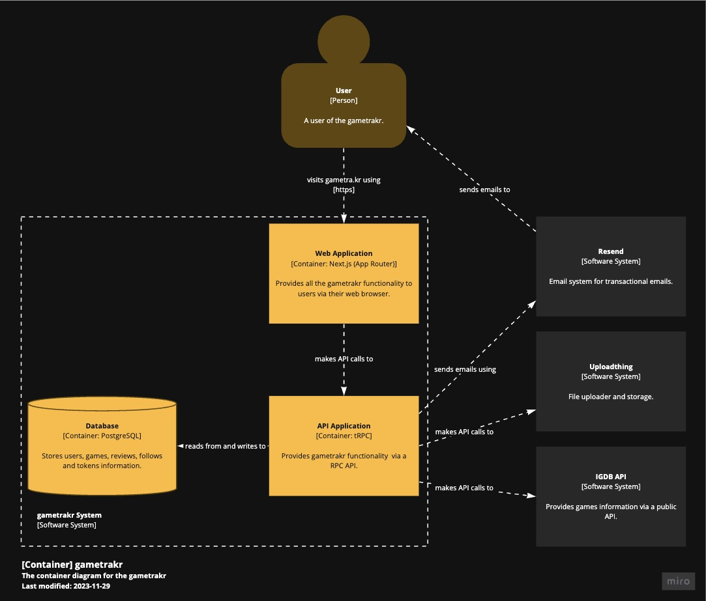
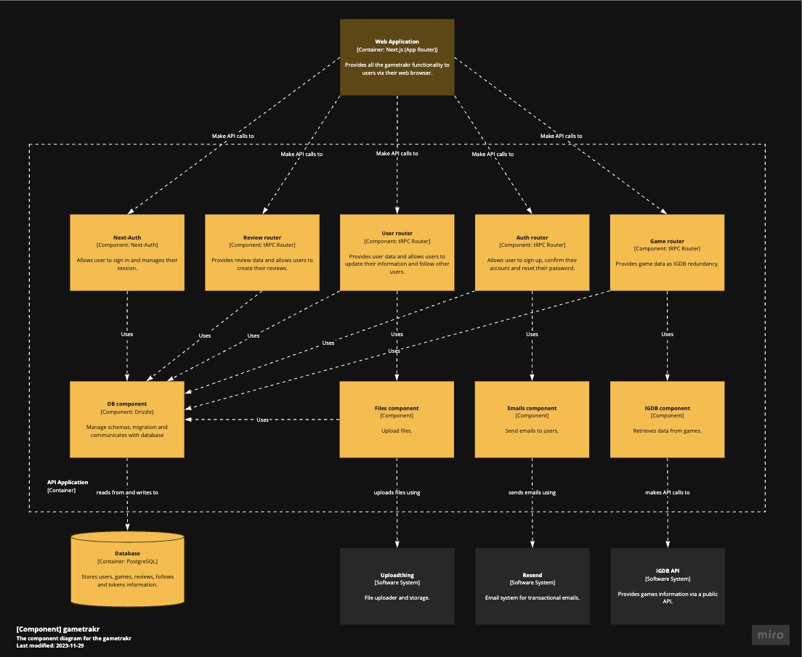
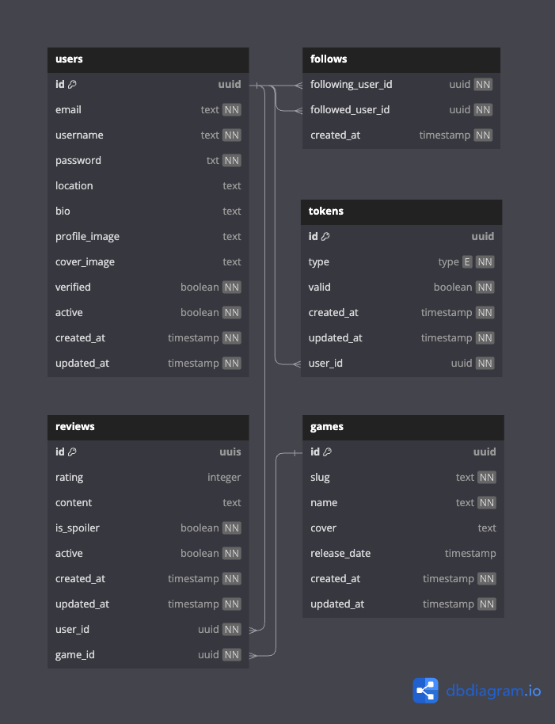

# C4 Architecture Model

## Context diagram

## Container diagram

## Component diagram

## Code diagram - Entity-relationship Model

---

**Note:** To update these diagrams, use [Miro](https://miro.com/app/board/uXjVMmnYwUY=/?share_link_id=727142855013) and [dbdiagram.io](https://dbdiagram.io/d/64fd399302bd1c4a5e462098).
