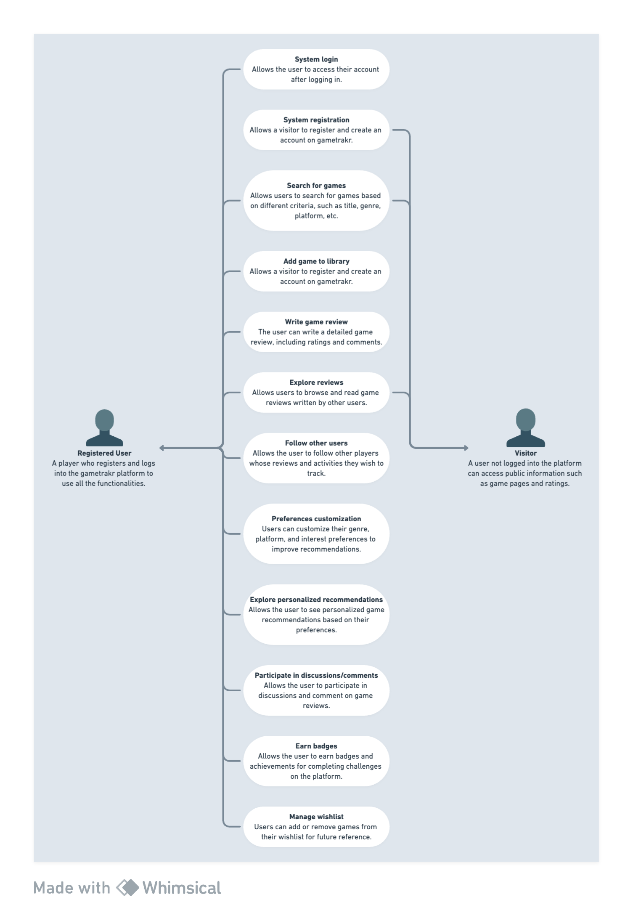

# Use cases

## Actors

1. **Registered user:** A player who registers and logs into the gametrakr platform to use all the functionalities.
1. **Visitor:** A user who is not logged into the platform but can access public information such as game pages and reviews.

## Use cases

1. **System login:**
   - **Actor:** Registered user
   - **Description:** Allows the user to access their account after logging in.
1. **System registration:**
   - **Actor:** Visitor
   - **Description:** Allows a visitor to register and create an account on gametrakr.
1. **Search games:**
   - **Actor:** Registered user, Visitor
   - **Description:** Allows users to search for games based on different criteria, such as title, genre, platform, etc.
1. **Add game to library:**
   - **Actor:** Registered user
   - **Description:** Allows a visitor to register and create an account on gametrakr.
1. **Write game review:**
   - **Actor:** Registered user
   - **Description:** The user can write a detailed game review, including ratings and comments.
1. **Explore reviews:**
   - **Actor:** Registered user, Visitor
   - **Description:** Allows users to browse and read game reviews written by other users.
1. **Follow other users:**
   - **Actor:** Registered user
   - **Description:** Allows the user to follow other players whose reviews and activities they wish to track.
1. **Preferences customization:**
   - **Actor:** Registered user
   - **Description:** Users can customize their genre, platform, and interest preferences to improve recommendations.
1. **Explore personalized recommendations:**
   - **Actor:** Registered user
   - **Description:** Allows the user to see personalized game recommendations based on their preferences.
1. **Participate in discussions/comments:**
   - **Actor:** Registered user
   - **Description:** Allows the user to participate in discussions and comment on game reviews.
1. **Earn badges:**
   - **Actor:** Registered user
   - **Description:** Allows the user to earn badges and achievements for completing challenges on the platform.
1. **Manage wishlist:**
   - **Actor:** Registered user
   - **Description:** Users can add or remove games from their wishlist for future reference.

## Use case diagram

